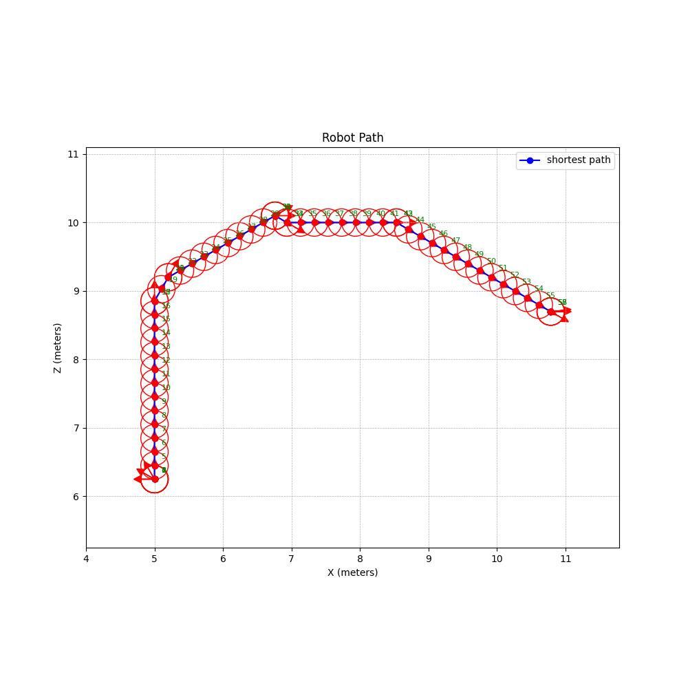
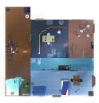
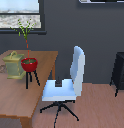

    ## Folder structure of the dataset 

    ├── 000092
    │   ├── HousePlant|HousePlant|9|72 # target object id
    │   │   ├── frame                  # observation
    │   │   │   ├── 0.png
    │   │   │   ├── 10.png
    │   │   └── metadata
    │   │       ├── actions.json      # actions
    │   │       ├── agent.json        # start agent info
    │   │       ├── navigation.npy.   # observation npy [n,128,128,3]
    │   │       ├── object.json       # target info
    │   │       ├── positions.json.   # agent position [t,r]
    │   │       ├── reference.json.   # ['random','expert']
    │   │       ├── robot_path.jpg    # robot path 
    │   │       └── test_top_down_along_path.jpg. # test_top_down_along
    │   ├── successful_objects.json   # find the target
    │   ├── house.json.               # house info

### Visual Samples

Below are some sample images illustrating the dataset:






## Environment Setup and Running with Docker

This guide explains how to set up and run the environment using Docker, including downloading the required datasets for house layouts and assets.

---

### Step 1: Set Environment Variables  

Before running the Docker container, set the following environment variables to specify the paths for code and data:

```bash
export CODE_PATH=/home/libo/l3cprocthor  # Path to the source code
export DATA_PATH=/pfs/mt-epYhpB/libo     # Path to save downloaded data
export DOCKER_IMAGE=docker.unsee.tech/khzeng777/spoc-rl:v2  # Docker image to be used
```

### Step 2: Run Docker
Use the following command to start the Docker container with the necessary configurations:

```
docker run \
    --gpus all \                            # Enable GPU usage
    --device /dev/dri \                     # Pass through GPU rendering device
    --mount type=bind,source=${CODE_PATH},target=/root/l3c_procthor \  # Bind source code
    --mount type=bind,source=${DATA_PATH},target=/root/data \          # Bind data directory
    --shm-size 100G \                       # Set shared memory size
    -it ${DOCKER_IMAGE}                     # Launch interactive container
```
### Step 3: Download House Layouts and Assets
#### 3.1 Download the Original Object Navigation Dataset
Run the following script to download the dataset:

```
cd /home/libo/program/l3cprocthor/projects/Procthor/third_party/spoc_robot_training
python -m scripts.download_training_data \
    --save_dir /pfs/mt-epYhpB/libo \      # Path to save the dataset
    --types fifteen                       # Specify dataset type
```
#### 3.2 Download Objaverse House Layouts
Download the Objaverse house layout data (subset: train):

```
python -m scripts.download_objaverse_houses \
    --save_dir /pfs/mt-epYhpB/libo/procthor/objaverse_houses/2023_07_28 \
    --subset train
```
#### 3.3 Download Objaverse Assets and Annotations
Download annotations:

```
python -m objathor.dataset.download_annotations \
    --version 2023_07_28 \
    --path /pfs/mt-epYhpB/libo/procthor/objaverse_assets
```
Download assets:

```
python -m objathor.dataset.download_assets \
    --version 2023_07_28 \
    --path "/pfs/mt-epYhpB/libo/procthor/objaverse_assets"
```
### Step 4: Set Additional Environment Variables
Set paths for Objaverse data and houses:

```
export OBJAVERSE_DATA_BASE_DIR="/pfs/mt-epYhpB/libo/procthor/objaverse_assets"
export OBJAVERSE_HOUSES_BASE_DIR="/pfs/mt-epYhpB/libo/procthor/objaverse_houses"
export OBJAVERSE_DATA_DIR="/pfs/mt-epYhpB/libo/procthor/objaverse_assets/2023_07_28"
export OBJAVERSE_HOUSES_DIR="/pfs/mt-epYhpB/libo/procthor/objaverse_houses/2023_07_28"
export PYTHONPATH="./"
```
### Step 5: Run the Demo Optimizer
Run the following script to execute the demo optimizer:

```
python /home/libo/program/l3cprocthor/projects/Procthor/expert/demo_optimizer.py

``` 
